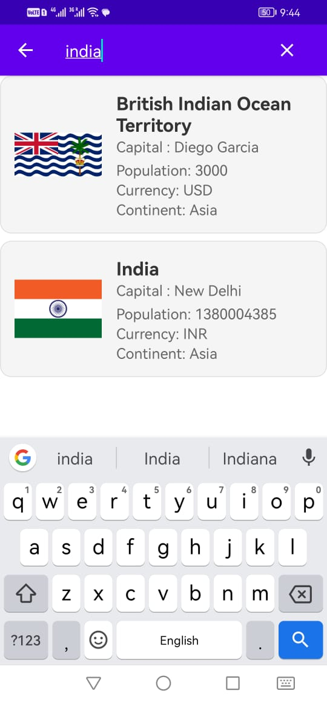
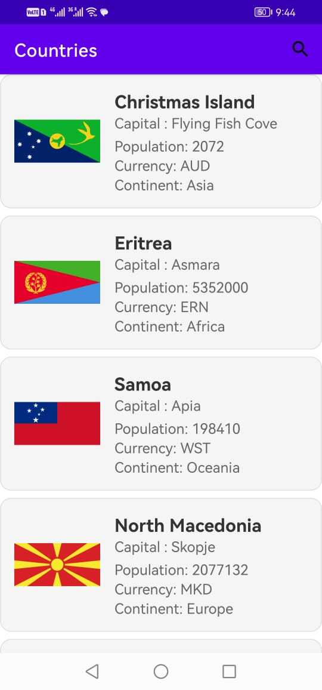

# Countries

## Overview

Countries is an informative Android application designed for smartphones. The app provides comprehensive demographic information about countries, including details such as capital city, population, currency, continent, and flag. Built with Kotlin and following the MVVM architecture, the app allows users to search for a country by name and retrieve all relevant information. The application integrates with the "https://restcountries.com" API, a free-to-use API that offers extensive data about countries.

## Features

- **Country Information:** Offers detailed demographic information about countries worldwide.
- **Search Functionality:** Allows users to search for a country by name for quick access to information.
- **MVVM Architecture:** Utilizes the MVVM architecture for organized and maintainable code.
- **API Integration:** Integrates with the "https://restcountries.com" API for real-time and accurate country data.

## Technology Stack

- **Language:** Kotlin
- **Architecture:** MVVM (Model-View-ViewModel)
- **API Integration:** "https://restcountries.com" API

## Project Responsibilities

- **Android App Development:** Developed the Android application using Kotlin, focusing on an intuitive user interface and MVVM architecture for efficient data handling.
- **MVVM Architecture Implementation:** Followed MVVM architecture principles to separate concerns and enhance code maintainability.
- **API Integration:** Integrated the "https://restcountries.com" API to fetch real-time and accurate country information.

## Outcome

Countries has emerged as a valuable resource for users seeking detailed demographic information about countries. The app provides a user-friendly interface for searching and accessing country data, and the MVVM architecture ensures a structured and maintainable codebase. The integration with the "https://restcountries.com" API ensures that users have access to up-to-date and reliable country information.

## Screenshots

  
